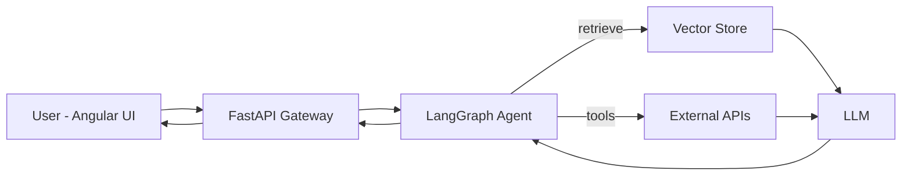

<div align="center">


[](https://git.io/typing-svg)


</div>

---

## 👋 About

I build **LLM-powered products end to end**: retrieval, orchestration, API, and UI. Engineer at **Tata Consultancy Services**, working on RAG systems and agentic workflows. My frontend background means the AI I ship has a real interface, not just a notebook.

```python
class Prabal:
    role     = "GenAI Engineer @ TCS"
    focus    = ["RAG", "Agentic workflows", "NLP", "LLM apps"]
    stack    = ["LangChain", "LangGraph", "FastAPI", "Angular", "Python"]
    exploring = ["Transformers", "LLM evaluation", "Deep Learning"]
    reach_me = "cprabal70@gmail.com"
```

---

## 🧠 What I Build

| | Capability | What it means |
|---|---|---|
| 🔎 | **RAG Pipelines** | Ingestion, chunking, embeddings, retrieval, grounded answers |
| 🕸️ | **Agentic Workflows** | Stateful, multi-step agents and tool use with LangGraph |
| 💬 | **NLP Solutions** | Text understanding, extraction, and generation for real use cases |
| ⚡ | **AI APIs** | Async, typed, documented services with FastAPI |
| 🎨 | **AI Frontends** | Angular UIs: chat, dashboards, streaming responses |

---

## 🏗️ How I Think About GenAI Systems



---

## 🛠️ Tech Stack

**GenAI & ML**


**Backend & Languages**


**Frontend**


**Tools**


---

## 📊 GitHub Stats

<div align="center">
  
  
  <br/>
  
</div>

---

## 🚀 Currently

- 🔭 Building RAG and agentic systems at **TCS**
- 🌱 Going deeper on **Transformers**, **LLM evaluation**, and **deep learning**
- 🤝 Open to collaborate on **GenAI / LLM** projects
- 💬 Ask me about **LangChain, LangGraph, RAG, FastAPI, or Angular**

---

## 🤝 Connect

<div align="center">

[](https://linkedin.com/in/prabal-chakraborty-82b61a212)
[](https://prabal-chakraborty-portfolio.vercel.app/)
[](mailto:cprabal70@gmail.com)
[](https://www.leetcode.com/prabal_chakraborty)


</div>
